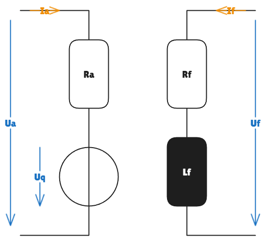
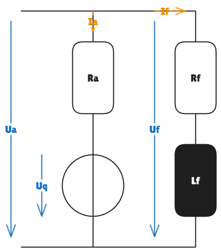

# Nebenschluss-Gleichstrommaschine 

Eine fremderregte Gleichstrommaschine besitzt die folgenden Kenndaten:

- Nennankerspannung: $U_{a,N} = 220\,\text{V}$
- Nennerregerspannung: $U_{f,N} = 150\,\text{V}$

Um die Flusskennline zu bestimmen, wird die fremderregte Maschine in einem Leerlauf mit $n_{0,\text{mess}} = 2000 \,\text{min}^{-1}$ betrieben, dies entspricht *keinen* Nennbetriebspunkt. Dabei wird die Quellenspannung $U_q$ in Abhängigkeit vom Erregerstrom $I_f$ bestimmt. Die Messdaten können durch folgende Funktion angenähert werden, wenn im Bogenmaß gerechnet wird:

$$
U_{q,\text{mess}}(I_f)
=
113\,\text{V} \cdot \arctan\!\left(\frac{I_f}{I_{f,N}}\right)
$$ 

## Aufgabe 1: Nebenschlussbetrieb

Wie groß ist die Leerlaufdrehzahl, wenn die Maschine im Nebenschluss betrieben wird und die Ankerspannung $U_{a,1} = 150\,\text{V}$ anliegt? Die Erregerwicklungen sind dabei parallel geschaltet.

### Ansatz 

a) Für die Gleichstrommaschine gilt allgemein:

$$
U_q = 2\pi \cdot n \cdot c\phi(I_f) \Rightarrow n = \frac{U_q}{2\pi \cdot c\phi(I_f)}
$$

b) Im Leerlauf fließt kein Ankerstrom, daher gilt: $U_q = U_a$

c) Die Flusskennline $c\phi(I_f)$ ist nur von der Maschine abhängig und damit im fremderregten Zustand sowie im Nebenschluss identisch. Sie kann aus den Messdaten bestimmt werden.  

$$
c\phi(I_f)
=
\frac{U_{q,\text{mess}}(I_f)}{2\pi \cdot n_{0,\text{mess}}}
$$

d) Mit dem konstanten Erregerwiderstand $R_f$ folgt:

$$
\frac{I_f}{I_{f,N}} = \frac{\frac{U_f}{R_f}}{\frac{U_{f,N}}{R_f}} =  \frac{U_f}{U_{f,N}}
$$

e) Im Nebenschluss gilt: $U_f = U_a$

### Rechnung

Aus a) und b) folgt:

$$
n_0 (U_{a,1}) 
= \frac{U_{a,1}}{2\pi \cdot c\phi(I_{f,1})}
$$

Einsetzen von c):

$$
n_0 (U_{a,1}) 
= \frac{U_{a,1}}{2\pi \cdot \frac{U_{q,\text{mess}}(I_{f,1})}{2\pi \cdot n_{0,\text{mess}}}}
= \frac{U_{a,1}\cdot n_{0,\text{mess}}}{U_{q,\text{mess}}(I_{f,1})}
= \frac{U_{a,1}\cdot n_{0,\text{mess}}}{113\,\text{V} \cdot \arctan\!\left(\frac{I_{f,1}}{I_{f,N}}\right)}
$$

Mit d) und e) folgt:

$$
n_0 (U_{a,1}) 
= \frac{U_{a,1}\cdot n_{0,\text{mess}}}{113\,\text{V} \cdot \arctan\!\left(\frac{U_{f,1}}{U_{f,N}}\right)}
= \frac{U_{a,1}\cdot n_{0,\text{mess}}}{113\,\text{V} \cdot \arctan\!\left(\frac{U_{a,1}}{U_{f,N}}\right)}
\approx 3380 \,\text{min}^{-1}
$$

## Aufgabe 2: Reihenschlussbetrieb

Die Erregerwicklung der Maschine wird nun in Reihe geschaltet. Wie groß ist die Leerlaufdrehzahl der Nebenschlussmaschine, wenn die Ankerspannung $U_{a,2} = 180\,\text{V}$ anliegt?

### Ansatz

<!-- TODO -->
